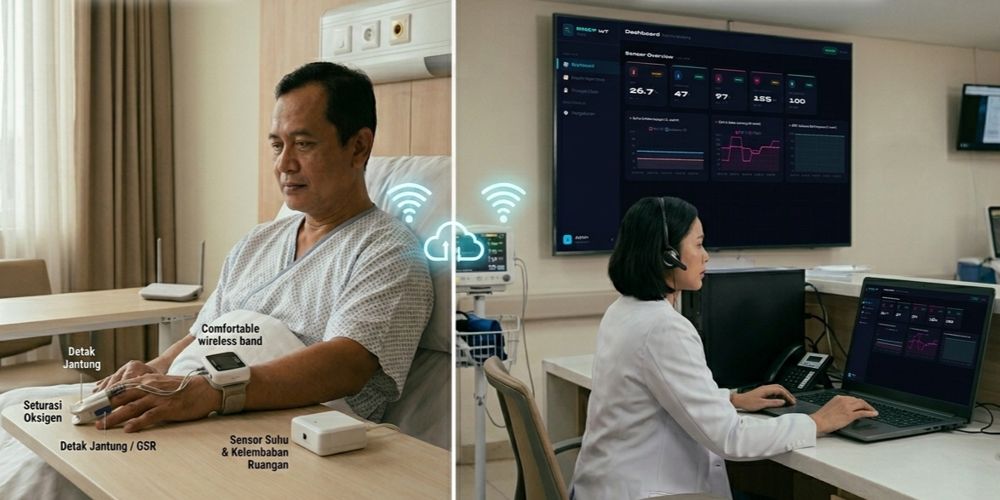

# BNSP IoT Monitoring System 🫀

Sistem monitoring kesehatan real-time berbasis IoT dengan Modbus TCP, MySQL, Telegram Bot, dan Web Dashboard.



---

## 📁 Struktur Proyek

```
bnsp_iot/
├── app.py              ← Main application
├── requirements.txt    ← Python dependencies
├── setup_db.sql        ← Script inisialisasi database
├── bnsp_iot.log        ← Log file (dibuat otomatis)
└── templates/
    ├── login.html      ← Halaman login
    └── dashboard.html  ← Dashboard utama
└── firmware/
    ├── firmware.ino    ← Main progrma
    └── ota_web.cpp     ← program c OTA web server
    └── ota_web.h       ← header OTA web server
```

---

## ⚙️ Konfigurasi (Edit app.py)

Sebelum menjalankan, sesuaikan variabel berikut di bagian `CONFIGURATION` pada `app.py`:

```python
# ── Modbus ──
MODBUS_HOST     = "192.168.18.254"   # IP perangkat Modbus
MODBUS_PORT     = 502
MODBUS_UNIT_ID  = 1
MODBUS_ADDRESS  = 1                  # Starting address
MODBUS_QUANTITY = 5                  # Jumlah register

# ── Telegram ──
TELEGRAM_TOKEN   = "YOUR_BOT_TOKEN_HERE"   # ← Token dari @BotFather
TELEGRAM_CHAT_ID = "YOUR_CHAT_ID_HERE"     # ← Chat ID tujuan notifikasi
```

### Cara mendapatkan Token & Chat ID Telegram:
1. Buka Telegram, cari **@BotFather**
2. Kirim `/newbot` → ikuti instruksi → salin token
3. Kirim pesan ke bot Anda, lalu buka:
   `https://api.telegram.org/bot<TOKEN>/getUpdates`
4. Temukan `"chat":{"id":XXXXXXX}` → itu Chat ID Anda

---

## 🚀 Instalasi & Menjalankan

### 1. Install Python dependencies
```bash
pip install -r requirements.txt
```

### 2. Setup Database MySQL
```bash
mysql -u root -p < setup_db.sql
```

### 3. Jalankan Aplikasi
```bash
python app.py
```

### 4. Buka Browser
```
http://localhost:5000
```
Login dengan: **admin / admin**

---

## 📐 Register Mapping (Modbus FC4)

| Register | Index | Parameter     | Skala | Contoh         |
|----------|-------|---------------|-------|----------------|
| 1        | [0]   | Temperature   | /10   | 365 → 36.5 °C  |
| 2        | [1]   | Humidity      | /10   | 650 → 65.0 %   |
| 3        | [2]   | SpO2          | /10   | 980 → 98.0 %   |
| 4        | [3]   | Heart Rate    | /10   | 720 → 72.0 bpm |
| 5        | [4]   | GSR           | /1    | 450 → 450      |

> ⚠️ Sesuaikan fungsi `scale()` di `app.py` jika ESP32 Anda menggunakan faktor skala berbeda.

---

## 🤖 Perintah Telegram Bot

| Perintah           | Fungsi                              |
|--------------------|-------------------------------------|
| `/start`           | Tampilkan panduan penggunaan        |
| `/ceksituasi`      | Lihat data sensor terkini           |
| `/setbatas 98.5`   | Ubah ambang batas SpO2 ke 98.5%     |

---

## 🌐 Web Dashboard

| Fitur              | Deskripsi                              |
|--------------------|----------------------------------------|
| Login Page         | Autentikasi sebelum akses dashboard    |
| Dashboard          | Kartu sensor + grafik live 20 titik   |
| Grafik Real-time   | 5 grafik terpisah, 100 data terakhir  |
| Riwayat Data       | Tabel 50 data terbaru                  |
| Pengaturan         | Ubah threshold SpO2 via web            |

---

## 🔌 API Endpoints

| Endpoint              | Method | Deskripsi                     |
|-----------------------|--------|-------------------------------|
| `/api/latest`         | GET    | Data sensor terbaru           |
| `/api/history`        | GET    | 100 data terakhir             |
| `/api/threshold`      | GET    | Ambang batas saat ini         |
| `/api/threshold`      | POST   | Update ambang batas           |

---

## 📦 Dependencies

```
Flask>=2.3.0           — Web framework
pymodbus>=3.5.0        — Modbus TCP client
pymysql>=1.1.0         — MySQL connector
pyTelegramBotAPI>=4.14 — Telegram bot
```

---

*BNSP IoT Monitoring System v1.0 — 2024*
